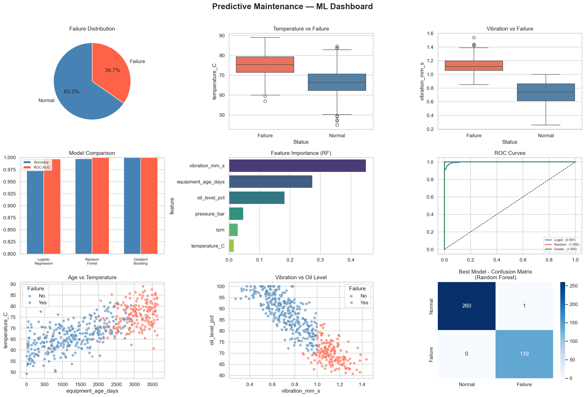
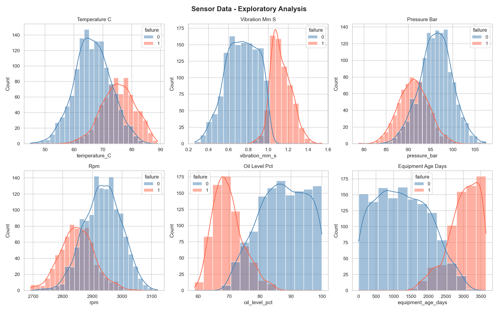
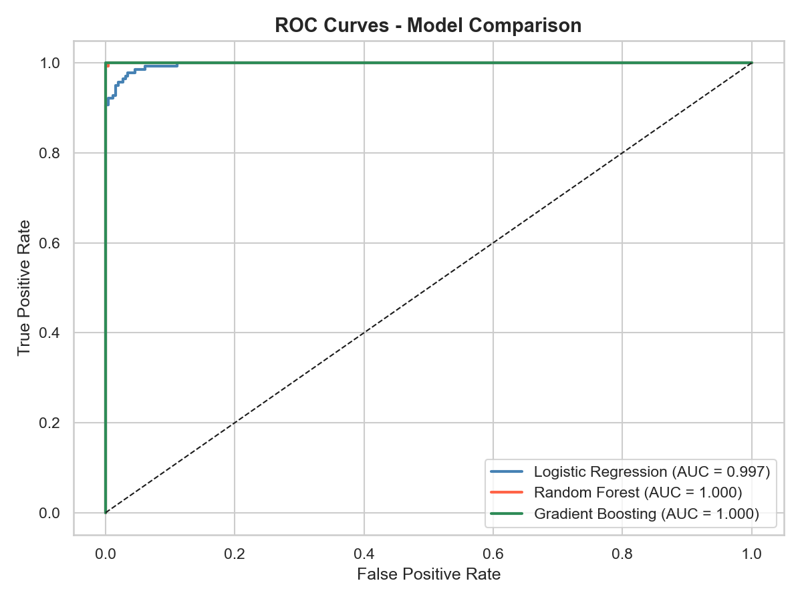
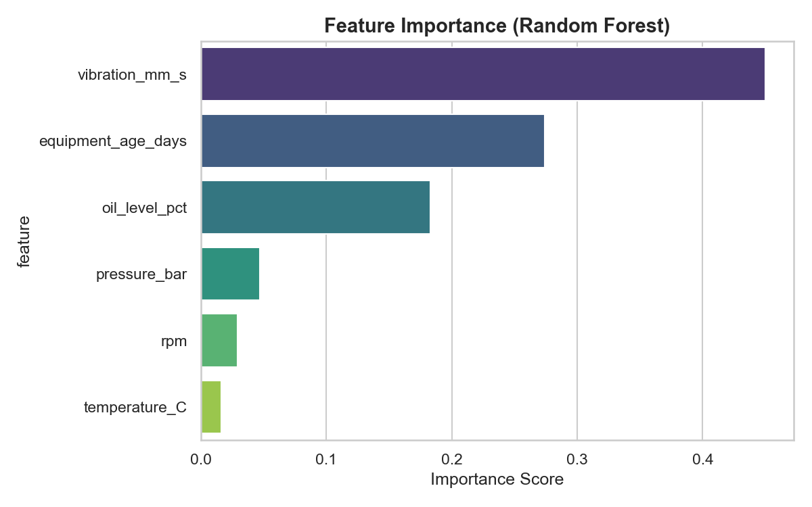
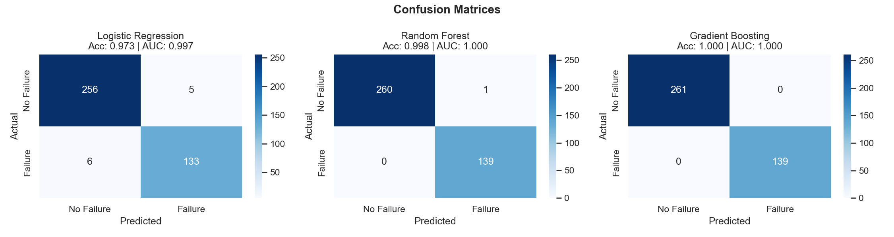

# Predictive Maintenance using Machine Learning

A machine learning project to predict equipment failures using real-time sensor data. Models are trained to classify equipment as **normal** or **at-risk of failure** based on sensor readings like temperature, vibration, pressure, RPM, and oil level.

## Dashboard Preview



## Problem Statement

Unplanned equipment failures lead to costly downtime. This project builds a predictive maintenance system that:
- Monitors sensor data from industrial equipment
- Detects early signs of failure before they occur
- Enables proactive maintenance scheduling

## Features

- Sensor data generation with realistic degradation patterns
- Exploratory Data Analysis (EDA) with visualizations
- Multiple ML models: Logistic Regression, Random Forest, Gradient Boosting
- Model comparison with accuracy, ROC-AUC, and confusion matrices
- Feature importance analysis
- Full dashboard visualization

## Results

| Model | Accuracy | ROC-AUC |
|---|---|---|
| Logistic Regression | 97.25% | 99.72% |
| Random Forest | 99.75% | 100.00% |
| Gradient Boosting | **100.00%** | **100.00%** |

**Top Predictive Features:**
1. Vibration (45.0%)
2. Equipment Age (27.4%)
3. Oil Level (18.3%)

## Tech Stack

- **Language:** Python 3
- **Libraries:** scikit-learn, pandas, numpy, matplotlib, seaborn
- **Algorithms:** Random Forest, Gradient Boosting, Logistic Regression

## Project Structure

```
predictive-maintenance-ml/
├── data/
│   ├── generate_data.py     # Synthetic sensor dataset generator
│   └── sensor_data.csv      # Generated dataset (2000 records)
├── src/
│   ├── preprocess.py        # Data loading, scaling, train-test split
│   ├── model.py             # Model training and evaluation
│   └── visualize.py         # All plots and dashboard
├── outputs/
│   ├── dashboard.png
│   ├── eda_distributions.png
│   ├── correlation_matrix.png
│   ├── confusion_matrices.png
│   ├── roc_curves.png
│   └── feature_importance.png
├── main.py                  # Entry point
└── requirements.txt
```

## Contributors

> This is a group project developed collaboratively.

- **Tatipamula Omkar** — [@omkar-1126](https://github.com/omkar-1126)
- **Sahithi Jaknam** — [@sahithi-jaknam](https://github.com/sahithi-jaknam)

## How to Run

```bash
# Install dependencies
pip install -r requirements.txt

# Run the full pipeline
python main.py
```

## Visualizations

### EDA - Sensor Distributions


### ROC Curves


### Feature Importance


### Confusion Matrices

